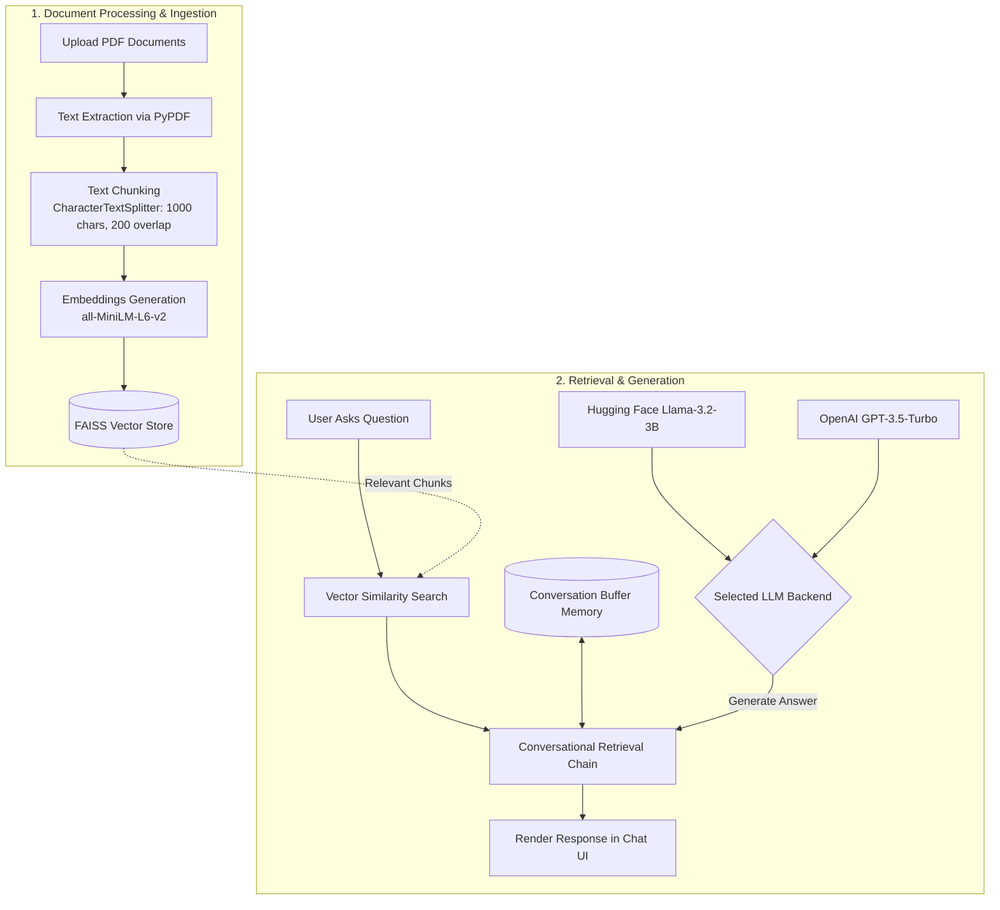

# 📚 DocMind: Multi-PDF RAG Q&A Chatbot

[](https://www.python.org/)
[](https://streamlit.io/)
[](https://www.langchain.com/)
[](https://github.com/facebookresearch/faiss)
[](https://huggingface.co/)
[](https://openai.com/)

**DocMind** is an intelligent, Retrieval-Augmented Generation (RAG) conversational assistant that allows you to chat interactively with one or multiple PDF documents simultaneously. Upload your documents, ask natural language questions, and receive accurate, context-aware answers backed directly by your files with conversation history memory.

---

## 🌟 Key Features

- 📑 **Simultaneous Multi-PDF Ingestion**: Upload multiple PDF documents at once; the system combines and processes them into a unified searchable knowledge base.
- 🧠 **Dual LLM Backend**:
  - **Hugging Face**: Runs `meta-llama/Llama-3.2-3B-Instruct` via the Hugging Face Inference API.
  - **OpenAI**: Supports `gpt-3.5-turbo` with conversational completion.
- ⚡ **Local Vector Search with FAISS**: Generates dense semantic embeddings using Hugging Face's `all-MiniLM-L6-v2` and indexes them in an ultra-fast in-memory FAISS vector store.
- 💬 **Conversational Context & Memory**: Uses LangChain's `ConversationBufferMemory` to maintain full context across continuous questions and follow-ups.
- 🎨 **Modern & Responsive UI**: Clean Streamlit interface styled with custom CSS, distinct user/bot avatars, and a dedicated sidebar for configuration and document management.
- 🛡️ **Graceful Error Handling**: Built-in notifications for empty/scanned PDFs, missing keys, and OpenAI quota exhaustion with fallback hints.

---

## 🏗️ Architecture & Workflow



---

## 📁 Project Structure

```text
RAG Q&A Chatbot/
├── app.py               # Main application entry point & Streamlit interface
├── html_template.py     # Custom CSS and HTML chat message templates
├── requirements.txt     # Python dependencies
├── .env.example         # Example environment variables template
├── .env                 # Local secrets file (API keys)
└── README.md            # Project documentation
```

---

## 🚀 Getting Started

### 1. Prerequisites

- **Python 3.10+** installed on your system.
- An API token from **Hugging Face** (free tier supported) and/or an **OpenAI API Key**.
  - Get a Hugging Face token: [huggingface.co/settings/tokens](https://huggingface.co/settings/tokens)
  - Get an OpenAI API key: [platform.openai.com/api-keys](https://platform.openai.com/api-keys)

### 2. Clone or Navigate to the Repository

```bash
cd "RAG Q&A Chatbot"
```

### 3. Create and Activate a Virtual Environment

**Windows (PowerShell):**
```powershell
python -m venv .venv
.\.venv\Scripts\Activate.ps1
```

**macOS / Linux:**
```bash
python3 -m venv .venv
source .venv/bin/activate
```

### 4. Install Dependencies

```bash
pip install -r requirements.txt
```

### 5. Configure Environment Variables

Copy the `.env.example` file to `.env`:

```bash
cp .env.example .env
```

Open `.env` and fill in your API credentials:

```env
# Hugging Face API Token (Recommended / Default)
HUGGINGFACEHUB_API_TOKEN=your_huggingface_token_here

# OpenAI API Key (Optional)
OPENAI_API_KEY=your_openai_api_key_here
```

> **Note:** The application includes automatic fallback aliases for environment keys (`OPENAI_API_KEY`, `openai_api_key`, `HUGGINGFACEHUB_API_TOKEN`, `hugginfface_api_key`, `HUGGINGFACE_API_KEY`, `HF_TOKEN`).

### 6. Run the Application

Launch the Streamlit web application:

```bash
streamlit run app.py
```

Open your web browser and navigate to `http://localhost:8501`.

---

## 🖥️ How to Use

1. **Select Model**: In the left sidebar under **Model Configuration**, choose your desired LLM:
   - `Hugging Face (Llama-3.2)` (Default)
   - `OpenAI (GPT-3.5)`
2. **Upload Documents**: Under **Upload your PDF documents**, click **Browse files** and select one or multiple PDF documents.
3. **Process**: Click the **Process** button and wait for text extraction, chunking, and FAISS indexing to complete.
4. **Chat**: Once the success banner appears, use the chat input bar at the bottom to query your documents.
5. **Clear History**: Click **Clear Chat** in the sidebar at any time to start a fresh conversation.

---

## 🛠️ Tech Stack & Components

| Component | Technology | Description |
| :--- | :--- | :--- |
| **Frontend UI** | Streamlit | Web framework for interactive chat interface |
| **Styling** | Custom HTML/CSS | Modern dark-themed chat bubbles and avatars |
| **PDF Extraction** | PyPDF (`PdfReader`) | Fast multi-page PDF text extraction |
| **Text Splitter** | LangChain `CharacterTextSplitter` | Splits raw text with chunk size 1000 and 200 overlap |
| **Embeddings** | `sentence-transformers` (`all-MiniLM-L6-v2`) | High-performance 384-dimensional dense embeddings |
| **Vector Store** | FAISS | In-memory similarity search and index clustering |
| **Orchestration** | LangChain (`ConversationalRetrievalChain`) | Manages context retrieval, prompt formatting, and LLM calls |
| **Memory** | `ConversationBufferMemory` | Preserves back-and-forth conversational state |
| **LLMs** | LLaMA 3.2 3B Instruct / OpenAI GPT-3.5 | Natural language generation and synthesis |

---

## ⚙️ Configuration Details

| Parameter | Default Value | Location | Description |
| :--- | :--- | :--- | :--- |
| **Embedding Model** | `all-MiniLM-L6-v2` | `app.py:create_vectorstore` | Hugging Face local embeddings model |
| **Chunk Size** | `1000` | `app.py:get_text_chunks` | Character count per document chunk |
| **Chunk Overlap** | `200` | `app.py:get_text_chunks` | Overlap between adjacent chunks |
| **HF LLM Model** | `meta-llama/Llama-3.2-3B-Instruct` | `app.py:HuggingFaceChat` | Hugging Face Chat completion model |
| **HF Temperature** | `0.1` | `app.py:HuggingFaceChat` | Sampling temperature for Hugging Face |
| **HF Max Tokens** | `512` | `app.py:HuggingFaceChat` | Maximum generated tokens per answer |
| **OpenAI Model** | `gpt-3.5-turbo` | `app.py:get_conversation_chain` | OpenAI model identifier |

---

## ❓ Troubleshooting

<details>
<summary><b>1. "OpenAI credit quota exhausted" error</b></summary>

- **Cause:** Your OpenAI account has exhausted its usage credits or does not have an active billing plan.
- **Solution:** Switch the model selector in the sidebar to **Hugging Face (Llama-3.2)**, which uses the Hugging Face Inference API.
</details>

<details>
<summary><b>2. "The uploaded PDFs contain no extractable text"</b></summary>

- **Cause:** The PDF may be an image-only or scanned document without an embedded text layer.
- **Solution:** Ensure your PDFs contain selectable digital text, or run OCR on scanned documents prior to uploading.
</details>

<details>
<summary><b>3. Hugging Face 401 / Authorization Error</b></summary>

- **Cause:** Invalid or missing Hugging Face API token.
- **Solution:** Check your `.env` file to make sure `HUGGINGFACEHUB_API_TOKEN` is set to a valid token with read permissions from [huggingface.co/settings/tokens](https://huggingface.co/settings/tokens).
</details>

---

## 📄 License

This project is open source and available under the [MIT License](LICENSE).
